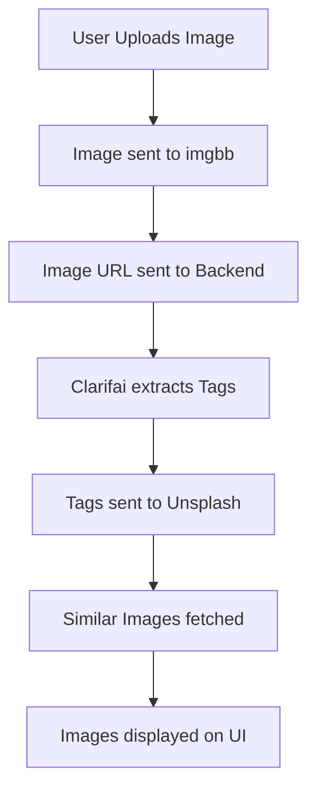

# 🎨 Vision Snap – AI-Powered Image Search Tool

**Vision Snap** is a full-stack AI-powered web application that lets users upload an image, extract intelligent tags using **Clarifai**, and retrieve similar images from **Unsplash**. It's designed with an intuitive UI and integrates seamlessly with three powerful APIs.

---

## ✨ Features

- 📤 Drag & Drop / Upload Image Option  
- 🧠 Auto-tag extraction using Clarifai AI  
- 🔍 Visual image search via Unsplash API  
- 🖱️ Manual search using tags (Search Gallery option)  
- ⚡ Live preview of similar images  
- 🎨 Clean, modern frontend with smooth UX  

---

## 🧰 Tech Stack

| Layer       | Technology              |
|-------------|--------------------------|
| Frontend    | React, Vite, HTML, CSS   |
| Backend     | Node.js, Express         |
| Image Tags  | Clarifai API             |
| Image Search| Unsplash API             |
| Hosting     | imgbb API (for image URL)|

---

## 🔁 Workflow

---

## 🔐 API Keys Required
Create accounts and get API keys from:
🔸 Clarifai: https://clarifai.com  
🔸 Unsplash Developers: https://unsplash.com/developers  
🔸 imgbb: https://api.imgbb.com/  

---

The code has been pushed to the master branch. Select the master branch and refer to the branch's readme file. 
