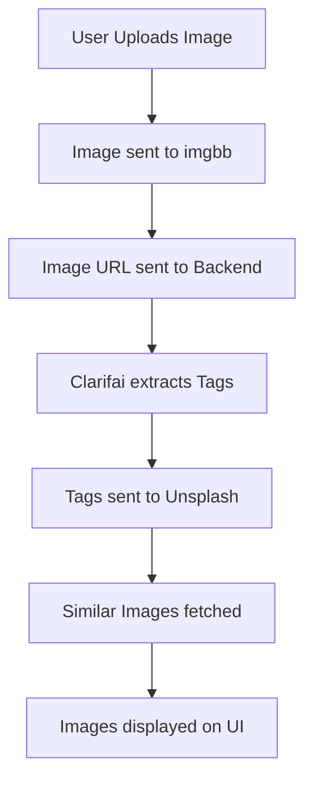

# 🎨 Vision Snap – AI-Powered Image Search Tool

**Vision Snap** is a full-stack AI-powered web application that lets users upload an image, extract intelligent tags using **Clarifai**, and retrieve similar images from **Unsplash**. It's designed with an intuitive UI and integrates seamlessly with three powerful APIs.

---

## ✨ Features

- 📤 Drag & Drop / Upload Image Option  
- 🧠 Auto-tag extraction using Clarifai AI  
- 🔍 Visual image search via Unsplash API  
- 🖱️ Manual search using tags (Search Gallery option)  
- ⚡ Live preview of similar images  
- 🎨 Clean, modern frontend with smooth UX  

---

## 🧰 Tech Stack

| Layer       | Technology              |
|-------------|--------------------------|
| Frontend    | React, Vite, HTML, CSS   |
| Backend     | Node.js, Express         |
| Image Tags  | Clarifai API             |
| Image Search| Unsplash API             |
| Hosting     | imgbb API (for image URL)|

---

## 🔁 Workflow

---

## 🔐 API Keys Required
Create accounts and get API keys from:
🔸 Clarifai: https://clarifai.com
🔸 Unsplash Developers: https://unsplash.com/developers
🔸 imgbb: https://api.imgbb.com/

---

### 📝 Example .env file (backend/.env)

UNSPLASH_ACCESS_KEY=your_unsplash_access_key
IMGBB_API_KEY=your_imgbb_api_key

---

## 📁 Folder Structure

vision-snap/
├── backend/
│   ├── index.js
│   ├── getTagsFromImage.js
│   ├── searchByTags.js
│   └── .env
└── vision-snap-frontend/
    ├── src/
    │   ├── App.jsx
    │   ├── App.css
    │   ├── main.jsx
    │   └── index.css
    └── package.json

---

# ⚙️ Setup Instructions

## 1️⃣ Clone the Repo
git clone https://github.com/your-username/vision-snap.git
cd vision-snap

## 2️⃣ Backend Setup
cd backend
npm install

Create a .env file and add your API keys as shown above.
Start the server: node index.js
-> Backend runs at http://localhost:6969

## 3️⃣ Frontend Setup
cd ../vision-snap-frontend
npm install
npm run dev

React frontend runs at http://localhost:5173 by default.

---

# 💻 How It Works

## Option 1: Upload Image
* Drag or upload an image.
* The frontend:
    *Sends image to imgbb.
    *Gets hosted image URL.
    *Sends it to the backend.
*Backend:
    *Passes URL to Clarifai API.
    *Receives and extracts tags.
    *Passes tags to Unsplash API.
    *Sends back image results to frontend.

## Option 2: Search Gallery
* Click Search Gallery.
* Enter manual tag/keyword.
* Backend uses Unsplash API to fetch matching images.

---

# 🧪 Testing
✅ Upload .jpg / .png files to test image search.
✅ Try different keywords in the Search Gallery field.
✅ Test error cases (e.g. no tags, invalid image, missing API key).

---

# 📦 Dependencies (Key Packages)

## Backend
* express
* axios
* dotenv
* node-fetch
* cors

## Frontend
* react
* axios
* vite

Install all using:
npm install

---

# 🙏 Acknowledgements

* [Clarifai API](https://www.clarifai.com/)
* [Unsplash API](https://unsplash.com/developers)
* [imgbb Image Hosting](https://api.imgbb.com/)
* Icons from [Emoji Guide](https://emojiguide.org/)

---
